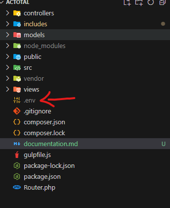
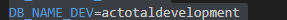

# Instrucciones para Ejecutar el Proyecto

Sigue estos pasos para configurar y ejecutar el proyecto:

## Paso 1: Instalar dependencias de npm

Para instalar las dependencias necesarias de Node.js, ejecuta el siguiente comando en tu terminal:

npm install
## Paso 2: Instalar dependencias de PHP(Importante: Instalar PHP(version 8.4.3) y Composer(2.8.5) )
Para instalar las dependencias necesarias de PHP, ejecuta el siguiente comando en tu terminal:
composer install

## Paso 3: Colocar las variables de entorno en la carpeta raíz del proyecto

## Paso 4: Crear una base de datos con mysql aca te dejo las instrucciones como puedes hacerlo
1- (CREATE DATABASE actotaldevelopment;) este comando te creara una base de datos llamada actotaldevelopment es la que usamos en el local si quieres usala si no
deberas cambiar el nombre de la base de datos en el archivo .env con la base de datos que creaste. ejemplo:

## Paso 5: Correr el script npm run start para levantar el servidor de php en modo local(importante tener php instalado)
npm run start